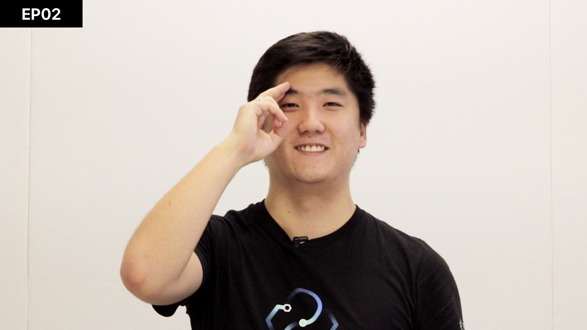
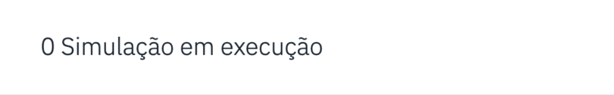

[](https://cloud.ibm.com)
[](https://developer.ibm.com/node/)
[](https://ibm.biz/convite-slack)

# Desafio 05 | BRF

* [1. Introdução](#1-introdução)
* [2. Reconhecimento visual](#2-reconhecimento-visual)
* [3. Controle de temperatura](#3-controle-de-temperatura)
* [4. Avaliação](#4-avaliação)
* [5. Pré-requisitos](#5-pré-requisitos)
* [6. Treinamento do modelo](#6-treinamento-do-modelo)
    * [6.1. Credenciais do Visual Recognition](#6-1-credenciais-do-visual-recognition)
* [7. Configure o Device no IoT Platform](#7-configure-o-device-no-iot-platform)
* [8. Aplicação na nuvem](#8-aplicação-na-nuvem)
    * [8.1. Veja como configurar o IBM Continuous Delivery](#8-1-veja-como-configurar-o-ibm-continuous-delivery)
    * [8.2. Credenciais na aplicação](#8-2-credenciais-na-aplicação)
* [9. Submissão](#9-submissão)

## Para te ajudar

* [Material de Apoio](#material-de-apoio)
* [Troubleshooting](#troubleshooting)
* [Dúvidas](#dúvidas)
* [License](#license)

## 1. Introdução

Dois dos grandes desafios das empresas do ramo alimentício que possuem seus produtos expostos para venda em diferentes estabelecimentos é manter os expositores devidamente abastecidos e organizados, sem lacunas, posição correta e sem danos, além de garantir que os produtos com as devidas condições de temperatura para manter a qualidade do produto.

Para resolver este problema, as empresas dispõem de funcionários para vistorias regulares e manutenção dos freezers. Porém, como geralmente as empresas possuem seus produtos expostos em diversos canais (supermercados, atacados, mercearias, lojas de conveniência, etc) fica inviável a logística de vistoria mais frequente, o que acaba resultando na má experiência dos clientes.

Baseado neste cenário, a BRF deseja criar um sistema que utilize inteligência artificial para identificar freezers não organizados adequadamente e que envie alertas nos casos em que a temperatura esteja fora do padrão aceito para manter a qualidade do produto.

Como citado anteriormente, conforme os clientes interagem com os produtos presentes nos freezers, pode ocorrer a danificação de algumas embalagens, a desorganização dos produtos ocasionando a falta de padronização e a danificação do próprio produto caso a temperatura do freezer estiver inadequada. 

Com isto a iniciativa visa posicionar uma câmera na frente de cada freezer que é acionada cada vez que o freezer sofre uma interação e um sensor de temperatura para cada freezer. 

A imagem capturada pela câmera será enviada para sistema automático de verificação e, após ser processada, ela será classificada nas seguintes categorias: organizado e desorganizado. Sendo assim, este desafio é composto por dois problemas: reconhecimento visual e controle de temperatura.

## 2. Reconhecimento visual

Nas fotos 1 é possível visualizar o *freezer* que está organizado.

<div align="center">
    
    <p>Figura 1: Exemplo de freezer organizado.</p>
</div>
<br>
<br>
<br>

As figuras 3 e 4 são exemplos de *freezers* desorganizados. Na figura 3 os produtos não estão dispostos na mesma ordem e na figura 4 é possível ver um produto totalmente diferente no *freezer*.

<div align="center">
    
    <p>Figura 3: Exemplo de freezer desorganizado.</p>
</div>
<br>
<br>
<br>

<div align="center">
    
    <p>Figura 4: Exemplo de freezer desorganizado.</p>
</div>
<br>
<br>
<br>

O objetivo deste desafio é criar um sistema automático de verificação de produtos. Para realizar esta atividade, aconselhamos que o participante utilize do produto *Watson Visual Recognition*. A base de dados de imagens será fornecida junto ao desafio para cada participante. Portanto, cada participante deve criar seu próprio classificador. Mas, antes terá que separar manualmente as imagens da base nas duas classes citadas anteriormente. Caso considere pertinente, cada participante pode manipular as imagens da base previamente afim de melhorar o acurácia de classificação do modelo do *Watson Visual Recognition*.

Lembrando que a câmera possui um posicionamento fixo frente ao *freezer*, portanto as imagens serão capturadas sempre do mesmo ângulo e não vão possuir nenhuma variação de luminosidade ou qualidade.

Cada participante deve considerar as seguintes definições para as classes organizado e desorganizado: 

* **Organizado**: todos os itens dispostos da mesma forma, todos os itens iguais na mesma pilha e sem nenhum objeto diferente da maioria dos demais objetos.
* **Desorganizado**: nem todos os itens estão dispostos da mesma forma ou itens em isolados em pilhas diferentes ou com algum objeto diferente da maioria dos demais produtos.  

## 3. Controle de temperatura

Como dito anteriormente, um freezer precisa manter uma temperatura adequada para os produtos que estão no freezer. Desta forma, faz parte deste exercício medir a temperatura dos freezers usando uma solução de IoT. Para este desafio, temos um (1) sensor em um (1) freezer. Este sensor está conectado em na plataforma de IoT Internet of Things Platform da IBM Cloud. 
Nesta parte do desafio você terá que criar um device lógico do tipo sensor de temperatura e criar um simulador para geração de dados de sensor.

## 4. Avaliação

### Reconhecimento de imagem
O sistema testará o reconhecimento de exposição dos freezers, através de envio de imagens de freezer organizados e não organizados, conforme os modelos criados pelo participantes. O participante pode criar uma classe, com o nome de `organizado` ou `desorganizado`, ou pode criar duas classes, com os nomes de `organizado` e `desorganizado`.

### Sensor de temperatura
O sistema de validação vai enviar dados fictícios de sensor para a solução do participante e validar os envios de alertas, de acordo com o valor enviado e ranges de temperaturas estabelecidos.

## 5. Pré-requisitos

Você deverá cumprir os seguintes itens:

- Registrar na [Maratona Behind the Code](https://ibm.biz/maratona) e confirmar o e-mail de cadastro.
- Registrar na [IBM Cloud](https://ibm.biz/BdzsFc) e confirmar o e-mail de cadastro.

## 6. Treinamento do modelo

🚨 **É POSSÍVEL USAR A MESMA INSTÂNCIA DO WATSON STUDIO E VISUAL RECOGNITION NESTE DESAFIO** 🚨

Veja o vídeo abaixo de como treinar o seu modelo de Visual Recognition, usando Watson Studio.

<div align="center">
    <a href="https://youtu.be/gM7aUQnE7n4">
        
    </a>
</div>

* Crie uma instância de [Watson Studio](https://cloud.ibm.com/catalog/services/watson-studio), em `Dallas` e acesse a plataforma, clicando no botão "Get Started".
* Separe o [dataset.zip](doc/source/dataset/dataset.zip) em duas classes: `organizado` e `desorganizado`.
* Faça o treinamento, com o [dataset.zip](doc/source/dataset/dataset.zip), no [Visual Recognition](https://cloud.ibm.com/catalog/services/visual-recognition).

### 6.1. Credenciais do Visual Recognition

🚨 **SALVE AS CREDENCIAIS. VOCÊ IRÁ PRECISAR PARA SUBIR A APLICAÇÃO** 🚨

Para pegar o `IAM_APIKEY` (ou, em alguns casos, `API Key` apenas), acesse o https://cloud.ibm.com/resources e veja na lista de `Service`, você encontrará todos os serviços provisionados na sua conta (incluindo o Watson Assistant, Discovery, Watson Studio, Visual Recognition e Machine Learning, serviços dos desafios 1, 2, 3 e 4). Lembre-se: **Caso você já tenha realizado o Desafio 3, você deve ter uma instância com o nome de `watson-vision-combined-dsx`. Este é o serviço do `Visual Recognition` criado pelo `Watson Studio`**. Não precisa criar outra instância.

<div align="center">
    <h2><b>Visual Recognition</b></h2>
    <h3><b>IAM_APIKEY na IBM Cloud</b></h3>
    
    <h3><b>CLASSIFIER_ID no Watson Studio</b></h3>
    
</div>

## 7. Configure o Device no IoT Platform

Veja o vídeo abaixo de como configurar um novo `device` no `Internet of Things Platform` e como configurar um simulador de dados no device.

<div align="center">
    <a href="https://youtu.be/LT_IsOUP3LY">
        
    </a>
</div>


* Crie uma instância de [Internet of Things Platform](https://cloud.ibm.com/catalog/services/internet-of-things-platform), em `Dallas` e acesse a plataforma, clicando no botão "Launch".
* Na aba `Devices`, crie um novo dispositivo clicando em , preenchendo o `Device Type` e `Device ID` (pule os próximos   campos, clicando em próximo) pois não há necessidade de preenchê-los – lembre-se: **Guarde as informações do seu dispositivo como o token pois você não terá acesso a elas depois**. 
* Após ter criado seu dispositivo, clique na aba aplicativos (lista do lado esquerdo da tela) , gere uma nova `API Key`, clicando no canto superior direito da tela, e ao criar selecione a opção `Standard Application`. Guarde sua chave API e token de autorização, pois o usaremos mais tarde. 
* Vá até a aba `Settings`, ative a opção `Last Event Cache` e o deixe configurado com validade de `7 dias`. Clique no menu do lado esquerdo na opção `Device Simulator` e a ative. 
* Depois de ativar o `Device Simulator` clique na aba que se encontra no canto inferior direito, conforme print abaixo. 

<div align="center">
    
</div>

Coloque o `Event type name` com o valor de `temperatura` e o `payload` com a estrutura abaixo.

* Uma aba suspensa será aberta (como um pop-up), clique no botão `+ Create simulation`, selecione o dispositivo que você criou anteriormente e configure o campo editável com as informações mostradas abaixo. 

```json
{
    "temperatura": random(0, 20)
}
```

Clique em salvar e em seguida clique no botão `Use Registered Device` selecione o seu dispositivo e feche a janela.


## 8. Aplicação na nuvem

Para subir a aplicação na IBM Cloud, você deve `clicar no botão` abaixo para subir usando o IBM Continuous Delivery (também conhecido como Delivery Pipeline). **Você deve subir a sua aplicação em Dallas**.

🚨 **CLIQUE PARA SUBIR A APLICAÇÃO NA IBM CLOUD** 🚨

[](https://cloud.ibm.com/devops/setup/deploy?repository=https://github.com/maratonadev/desafio-5)

### 8.1. Veja como configurar o IBM Continuous Delivery

1. Configure o `Toolchain Name` com `<maratona-id>-desafio5-behindthecode`, substituindo o `<maratona-id>` pelo seu ID da Maratona (Ex: 100001). Se você não souber, verifique no seu e-mail, usado no registro da Maratona, para pegar o seu ID.

2. Configure o `App name` com a mesmo valor usado no item 1.

3. Crie uma chave (de uso interno). Basta clicar em "Create" e depois clique em "Create" novamente. Espere um instante até carregar todas os dados. Se demorar muito (mais de 5 minutos), recarregue a página e faça novamente o passo 1 e 2. **Na parte superior, você pode deixar em Washington DC ou Dallas. Já na parte inferior (abaixo do item 2), é mandatório configurar a Região de Dallas**. 

<div align="center">
    
</div>

### 8.2. Credenciais na aplicação

Clique em `Eclipse Orion Web IDE` para configurar a aplicação.

<div align="center">
    
</div>

Abaixo está o passo-a-passo, **obrigatório**, para configurar a sua aplicação no Eclipse Orion Web IDE.

1. Abra o arquivo `.env` para colocar as credenciais do `Visual Recognition`, `Internet of Things Platform` e da `Maratona` (lembre-se de que é o mesmo código usado para indicar novos participantes na Maratona). Preencha com os dados, após o `=` (símbolo de igual).

```
# Credenciais para o Desafio 5
DESAFIO=5
MARATONA_ID=

# Visual Recognition
IAM_APIKEY=
CLASSIFIER_ID=

# Internet of Things Platform
ORG_ID=
API_KEY=
AUTH_TOKEN=
DEVICE_ID=
DEVICE_TYPE=
DEVICE_TOKEN=
```

<div align="center">
    
</div>

2. Abra o arquivo `manifest.yml` e altere o `<maratona-id>` com o seu ID da Maratona, o mesmo usado acima. Lembre-se: é mandatório ter a URL com o formato do `name`, apresentado abaixo.

```
applications:
- name: <seu-id>-desafio5-behindthecode
  memory: 256M
  instances: 1
  buildpack: sdk-for-nodejs
```

<div align="center">
    
</div>

Clique em `Create new launch configuration` e crie a configuração para a sua aplicação (que está sendo criada em *background*). `Launch Config Name`, `Application Name` e `Host` devem ter o mesmo nome, com o formato `<maratona-id>-desafio5-behindthecode`, igual nos itens anteriores. Clique em `SAVE` para salvar as configurações.

<div align="center">
    
    
</div>

Clique em `PLAY` (primeiro botão na imagem). Espere até ficar `verde` (com o status: `running`). Depois, clique em `Open` (terceiro botão na imagem). Vai abrir a sua aplicação, com as configurações implementadas.

<div align="center">
    
    
</div>

## 9. Submissão

🚨 **TESTE BASTANTE O SEU MODELO DE TREINAMENTO** 🚨

Mande várias imagens ou fotos para testar o seu modelo. Faça quantos testes forem necessários e, se precisar, treine e re-treine o seu modelo para melhorar cada vez mais. Quando se sentir confortável, faça a submissão do seu desafio. Lembre-se: **NÃO é possível submeter mais de uma vez**. Fique atento!

Através da aplicação na IBM Cloud (`https://<maratona-id>-desafio5-behindthecode.mybluemix.net`), você irá clicar no botão **SUBMETER DESAFIO**, preencher com o seu CPF e enviar para a avaliação final.

FIQUEM LIGADOS NO [SITE DA MARATONA](ibm.biz/maratona) PARA ACOMPANHAR O RANKING GERAL E O RANKING DO DESAFIO! FIQUE NA TORCIDA PARA ESTAR ENTRE OS MELHORES!

## Material de apoio

- [O que é a IBM Cloud e como subir a sua primeira aplicação na nuvem](https://medium.com/ibmdeveloperbr/o-que-%C3%A9-a-ibm-cloud-e-como-subir-a-sua-primeira-aplica%C3%A7%C3%A3o-na-nuvem-41bfd260a2b7?source=friends_link&sk=7944d2fe14aa940e9bade68ce0731ba0)
- [O que é Internet das Coisas](https://youtu.be/TWXYB3F3cBY)

## Troubleshooting

1. No `Logs` da aplicação, apresentou um erro (em vermelho). O que pode ser? 

    Resposta: **Veja se você colocou as credenciais da Maratona, Watson Assistant e Machine Learning no arquivo `.env` e se o arquivo `manifest.yml` está correto, conforme [descrito acima](#credenciais-na-aplicação). Veja se a sua aplicação está rodando na URL correta conforme [descrito acima](#submissão).**

2. Houve algum erro para conectar o `Internet of Things Platform`. Como corrigir? 

    Resposta: **Abra o arquivo `IoT.controller.js` e altere a linha 19 ~> `"auth-method": "use-token-auth"` para `"auth-method": "token"`. Aperte o botão `PLAY` para subir as alterações. Espere até concluir e teste novamnete.**

## Dúvidas

Acesse o slack e mande a sua dúvida: [ibm.biz/convite-slack](https://ibm.biz/convite-slack).

## License

Copyright 2019 Maratona Behind the Code

   Licensed under the Apache License, Version 2.0 (the "License");
   you may not use this file except in compliance with the License.
   You may obtain a copy of the License at

       http://www.apache.org/licenses/LICENSE-2.0

   Unless required by applicable law or agreed to in writing, software
   distributed under the License is distributed on an "AS IS" BASIS,
   WITHOUT WARRANTIES OR CONDITIONS OF ANY KIND, either express or implied.
   See the License for the specific language governing permissions and
   limitations under the License.
